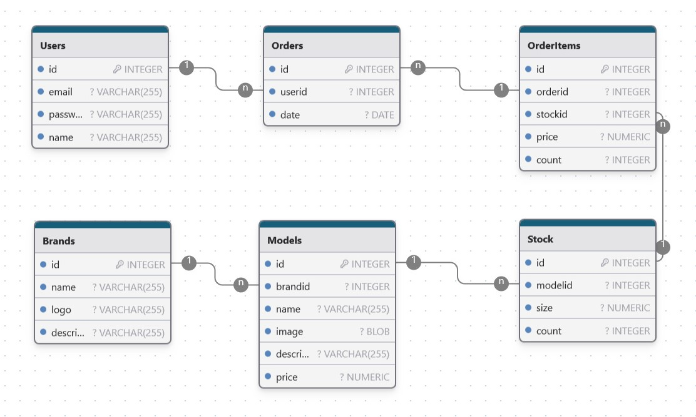

<a id="readme-top"></a>
# Running Shoes Wharehouse App

<!-- ABOUT THE PROJECT -->
## About The Project

This the simpe application implementing the very basic backend and frontend functions of Running shoes internet store build to test various www technologies.
The application has benn created for educational purposes to use various technologies and libraries. 

### Technologies and libraries used

We have used the following technologies/libraries/packages for this application:

* Node.js - to build fast and easy web server and API library.
* Express - as a web application framework.
* SQLite - relational database to store project data.
* Embedded JavaScript (EJS) - simple templating engine to generate HTML.
* Sequelize -  to assist querying the database.
* Bcrypt - to hash passwords.
* Helmet - to secure Express apps by setting HTTP response headers.
* Cookie-parser - to parse HTTP request cookies
* Commander - to parse command line parameters.
* Jsonwebtoken - to securely transmit tokens.
* Cors - to control access to resources on different domains.
* Dotenv -to store and access securely app parameters, API keys, passwords.

<p align="right">(<a href="#readme-top">back to top</a>)</p>

<!-- GETTING STARTED -->
## Getting Started

This is an example of how you may give instructions on setting up your project locally.
To get a local copy up and running follow these simple example steps.

### Installation
1. Clone this repository.
2. Install dependencies by running `npm install <package name>` for all packages `from package.json`.
3. Set environment parameters (PORT and database storage location) by edit `.env` file.
4. Run this command from application home directiory to create data base and load test data.
```sh
node ./bin/index.js --init
```

### Run application.
Run this command home directiory:
```sh
npm start
```
or
```sh
node ./bin/index.js
```
<p align="right">(<a href="#readme-top">back to top</a>)</p>

## Usage
You can run the application in two ways:
* There is and html interface that can be accessed at `http://localhost:PORT/www/`
* And there is API available at `http://localhost:PORT/api/`
* For using ans API you need to login first.

## DB structure
Here is the database structure:


## Authors

Alexander Z. & Semyon M.

<p align="right">(<a href="#readme-top">back to top</a>)</p>
